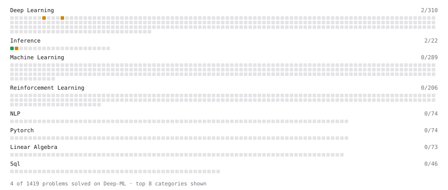

# Deep-ML

My machine learning practice from [Deep-ML](https://www.deep-ml.com). Every solution here was written by hand.

**3** solved · 3 problems · 0 labs · 0 math

[**Browse the interactive portfolio**](https://mrjoema.github.io/deep-ml/) to replay this filling in over time.

## Problems

| | Difficulty | Solved | |
| --- | --- | --- | --- |
| [Compute Arithmetic Intensity and Classify Bottleneck](https://www.deep-ml.com/problems/414) | easy | 2026-09-17 | [solution](problems/0414-compute-arithmetic-intensity-and-classify-bottleneck) |
| [Implement Self-Attention Mechanism](https://www.deep-ml.com/problems/53) | medium | 2026-09-15 | [solution](problems/0053-implement-self-attention-mechanism) |
| [Roofline Model Analysis for GPU Operations](https://www.deep-ml.com/problems/415) | medium | 2026-09-17 | [solution](problems/0415-roofline-model-analysis-for-gpu-operations) |

---

_This file is regenerated by Deep-ML on every push._
